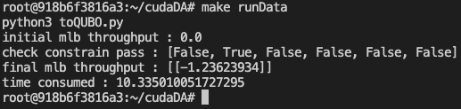
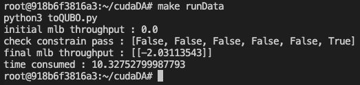
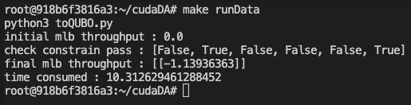

Parameter settings:

1. penalty = 100
2. Monte Carlo steps = 100,000

When tested individually, only constraint 2 and constraint 6 passed their test.

c22d:\

c62d:\

When combine these two constraints and test together, both of them passed the test.

c22d+c62d:\

However, all other constraints and combination of constraints failed their constraints test